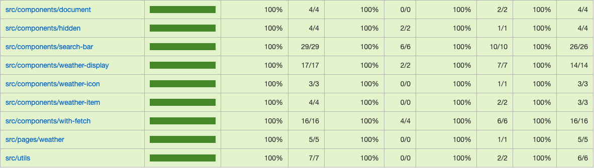
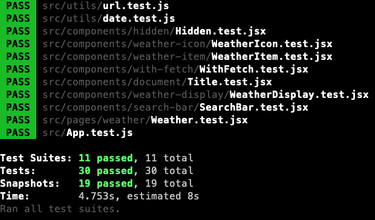

# Weather App
This project was bootstrapped with [Create React App](https://github.com/facebook/create-react-app).

## Features
This project is a Weather app includes features:
- [x] Search location by typing
- [x] When clicking the location in the search result, application will get the weather data within 6 days since today then show them.
- [x] Data source is https://metaweather.com/api

## Quality
- The `weather-app` is fully unit tested with `100% coverage`  and `100% pass`
### Coverage

### Unit test
 

## Set up guide
This application contains 2 parts:
- `weather-server` - `NodeJS`
- `weather-app` - `ReactApp`
### Weather Server

#### Problem statements

`metaweather` does not allow other web apps to use their api without their permission. So, if we request from our origin `http://localhost:3000`, we will get the `CORS` error.

Due to that reason, `weather-server` is a `NodeJS` that forward the requests from the `weather-app` to the `metaweather` api then response the result back.
 
#### Instructions

1. Run `yarn install-server` to install the required server dependencies.
2. Run `yarn start-server` to start the `weather-server`

If the set up is correct, you would see a message from the console 
```shell script
$    App is listening at : 4000
```

### Weather App

#### Instructions
1. Run `yarn install` to install the require dependencies.
2. Run `yarn start` to start the dev server.  

## Available Scripts

In the project directory, you can run:

### `yarn start`

Runs the app in the development mode.<br />
Open [http://localhost:3000](http://localhost:3000) to view it in the browser.

The page will reload if you make edits.<br />
You will also see any lint errors in the console.

### `yarn test`

Launches the test runner in the interactive watch mode.<br />
See the section about [running tests](https://facebook.github.io/create-react-app/docs/running-tests) for more information.

### `yarn build`

Builds the app for production to the `build` folder.<br />
It correctly bundles React in production mode and optimizes the build for the best performance.

The build is minified and the filenames include the hashes.<br />
Your app is ready to be deployed!

See the section about [deployment](https://facebook.github.io/create-react-app/docs/deployment) for more information.


### `yarn install-server`

Install the dependencies for the `weather-server`

### `yarn start-server`

Start the `weather-server`
